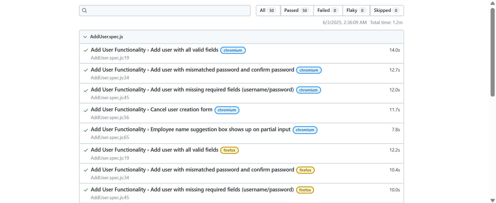

# OrangeHRM UserManagement AutomationTesting

- **Tech Stack:** JavaScript
- **Methodology:** Page Object Model (POM)
- **Tool:** Playwright

# Project Setup

## 1 Test Cases Organization

- All **test cases** are located in the `/tests` folder.
- All **page modules** are located in the `/pages` folder, following the POM design pattern.

## 2 To Run Test cases

### STEP 1 : clone the project in the local system

- open ternimal and paste the below code with the url you copied

  ` git clone "paste the url you copied here"`

  Replace "paste the url you copied here" with the actual URL.

### STEP 2 : project setup

- inisde project folder run the below command in the terminal

  `npm i`

### STEP 3 : run test

- inide the project folder open the ternimal and run the following code

  `npx playwright test`

# RESULT SCREENSHOT

- TOTAL TEST CASES = 50
- PASSED TEST CASES = 50✅

  

# RESULT Recording

- Since the UI is opensource and keeps changing therefore here is the recording of pass result based on the website previous UI version

- `Note: The video file is too large for GitHub to display a preview.  
To view it, please:
Clone the repository and play it locally  
[OR]
Click on view raw to see a raw format`

👉 [The result video has been uploaded in the resultScreenshot folder click here to navigate to the folder](./resultScreenshot/ResultRecording.mp4)
